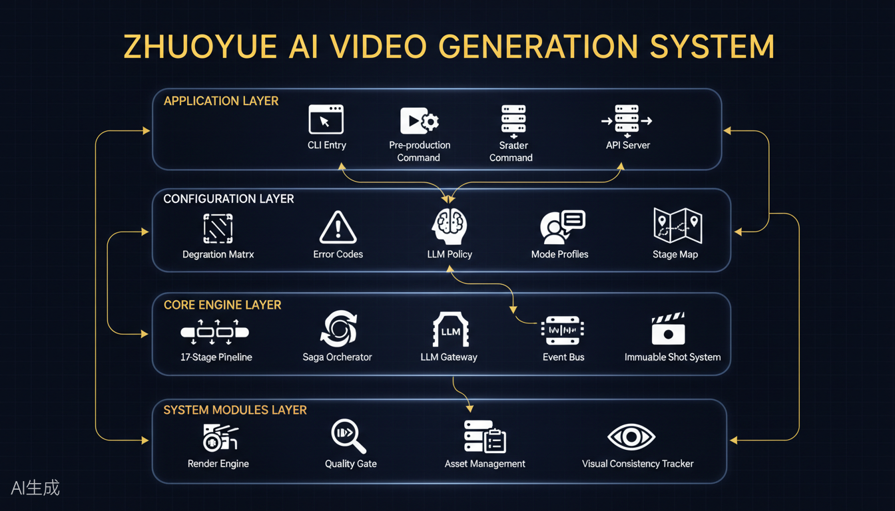
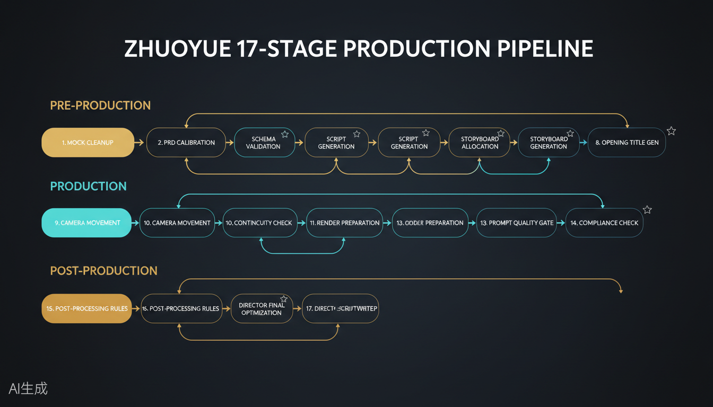
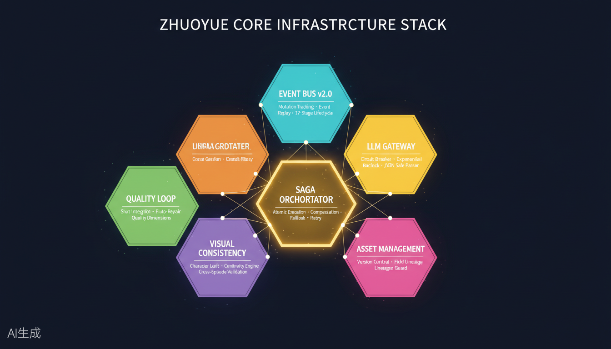
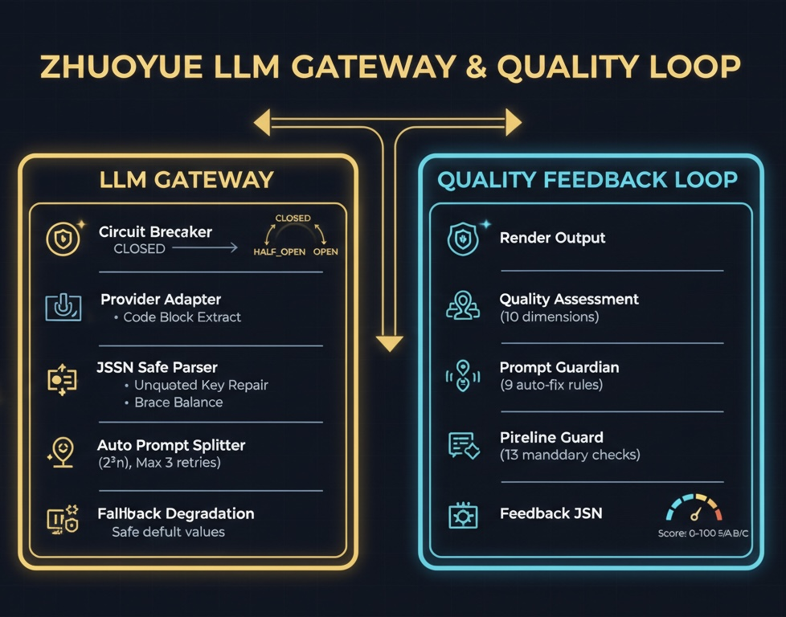
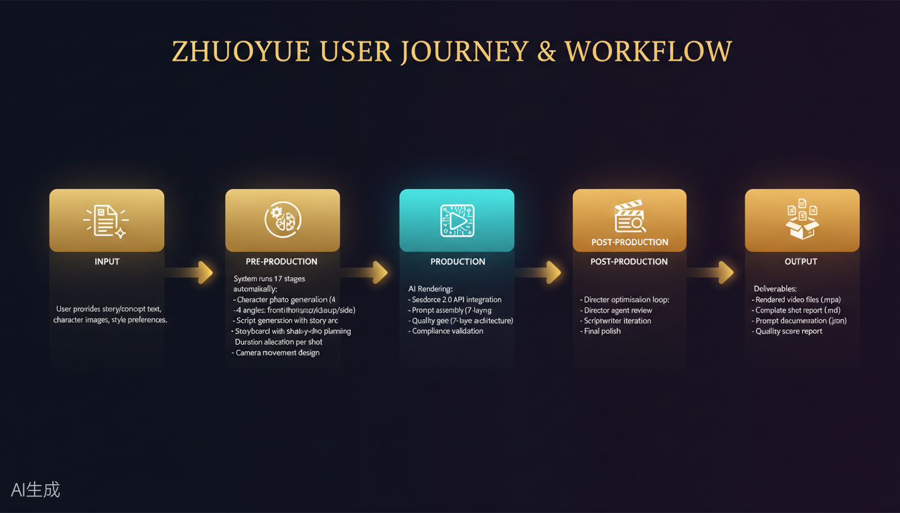

# Zhuoyue (卓越) AI Video Generation System

<p align="center">
  
</p>

<p align="center">
  <b>From Script to Screen — Autonomous AI Video Production</b><br>
  <i>Harnessing Imagination · 驾驭想象力</i>
</p>

<p align="center">
  <a href="#quick-start">Quick Start</a> ·
  <a href="#architecture">Architecture</a> ·
  <a href="#api-reference">API</a> ·
  <a href="#contributing">Contribute</a> ·
  <a href="https://github.com/geniusdapeng-collab/zhuoyue/issues">Issues</a>
</p>

<p align="center">
  
  
  
  
  
</p>

> ⚠️ **限时内测版** — 当前版本为限时开放测试，未来可能转为付费版本或调整功能范围。建议及时 Star 和 Fork 以锁定当前版本。

---

## What is Zhuoyue?

Zhuoyue ("卓越" means excellence in Chinese) is an **industrial-grade AI video production pipeline** that automates the entire filmmaking process — from story concept to final rendered video. It runs **17+ automated stages** across pre-production, production, and post-production, producing cinema-quality prompts and coordinating with the Seedance 2.0 video generation API.

Built on a **4-layer architecture** with production-hardened infrastructure including circuit breakers, saga orchestration, event-driven mutations tracking, and immutable shot management, Zhuoyue is designed for both **human creators** and **AI agents**.

### Key Capabilities

| Capability | Description |
|------------|-------------|
| **17-Stage Pipeline** | Complete production workflow: PRD → Script → Storyboard → Camera → Render → Director Review |
| **Saga Orchestration** | Atomic stage execution with compensation, fallback, and retry policies |
| **LLM Gateway** | Unified LLM access with circuit breaker, exponential backoff, and JSON safe parsing |
| **7-Layer Prompt Architecture** | Structured prompt assembly: Constraint → Foundation → Space → Subject → Dynamic → Style → Audio |
| **Character Consistency** | 4-angle portrait system (front / three-quarter / closeup / side) with identity lock |
| **Director Agent** | AI director that reviews shots, scores quality, and iterates with the scriptwriter |
| **Quality Feedback Loop** | 10-dimension quality assessment with auto-repair and scoring (0-100, S/A/B/C grades) |
| **Event Bus v2.0** | Full mutation tracking, event replay, and 17-stage lifecycle observability |
| **Asset Management** | Version-controlled asset system with deduplication, lineage, and lifecycle management |

---

## Architecture

### System Overview



### 4-Layer Architecture

```
┌─────────────────────────────────────────────────────────────┐
│                    APPLICATION LAYER                         │
│  CLI Entry  │  Pre-production Command  │  API Server        │
├─────────────────────────────────────────────────────────────┤
│                   CONFIGURATION LAYER                        │
│  Degradation Matrix · Error Codes · LLM Policy · Stage Map  │
├─────────────────────────────────────────────────────────────┤
│                     CORE ENGINE LAYER                        │
│  17-Stage Pipeline · Saga Orchestrator · LLM Gateway        │
│  Event Bus v2.0 · Immutable Shot · Quality Feedback Loop    │
├─────────────────────────────────────────────────────────────┤
│                    SYSTEM MODULES LAYER                      │
│  Render Engine · Quality Gate · Asset Management            │
│  Visual Consistency Tracker · Narrative Continuity Engine   │
└─────────────────────────────────────────────────────────────┘
```

### 17-Stage Production Pipeline



| Phase | Stages | Purpose |
|-------|--------|---------|
| **Pre-Production** | STAGE-0 to STAGE-8.5 | Concept validation, script generation, storyboarding, character setup |
| **Production** | STAGE-9 to STAGE-14 | Camera design, rendering, quality gating, compliance |
| **Post-Production** | STAGE-15 to STAGE-17 | Director optimization, scriptwriter loop, final polish |

### Core Infrastructure



### LLM Gateway & Quality Loop



### User Journey



---

## Quick Start

### Prerequisites

- Node.js >= 24
- Volcano Engine account with Seedance 2.0 API access
- Kimi API key (or compatible OpenAI-format LLM provider)

### Installation

```bash
# Clone the repository
git clone https://github.com/geniusdapeng-collab/zhuoyue.git
cd zhuoyue

# Install dependencies
npm install

# Configure environment
cp .env.example .env
# Edit .env with your API keys

# Run pre-production for a story
node app/cli.js preproduction --input stories/my-story.json
```

### First Run

```bash
# Create a story input file
cat > stories/my-first-video.json << 'EOF'
{
  "title": "The First Light",
  "genre": "sci-fi",
  "duration": 60,
  "characters": [
    {
      "name": "Aria",
      "role": "protagonist",
      "description": "A young astronaut with short silver hair"
    }
  ],
  "plot": "Aria discovers the first sunrise on a distant colony planet",
  "style": "cinematic, 4K, golden hour lighting"
}
EOF

# Run the full pipeline
node app/cli.js preproduction --input stories/my-first-video.json
```

### Output Structure

```
output/
├── preproduction-report.md     # Complete shot-by-shot report
├── prompts.json               # Render-ready prompts per shot
├── render-tasks.json          # Seedance API render requests
└── quality-report.json        # 10-dimension quality assessment
```

---

## Agent-Native Usage

Zhuoyue is built for AI agents. Here's how to use it programmatically:

```javascript
const { runPreproduction } = require('./systems/preproduction-service');

const result = await runPreproduction(storyInput, {
  mode: 'zhuoyue',           // or 'commercial', 'documentary'
  outputDir: './output',
  projectConfig: {
    requiredCharacters: ['aria'],
    isPreProduction: true
  }
});

// result contains:
// - complete shot list with prompts
// - quality scores per shot
// - render-ready task definitions
// - full markdown report
```

### MCP Server Integration

Zhuoyue exposes a Model Context Protocol (MCP) server for seamless agent integration:

```javascript
// tools available to agents:
{
  "zhuoyue_preproduction": "Run full pre-production pipeline",
  "zhuoyue_render": "Submit render tasks to Seedance",
  "zhuoyue_quality_check": "Run quality assessment",
  "zhuoyue_director_review": "Run director optimization agent",
  "zhuoyue_storyboard": "Generate shot storyboard",
  "zhuoyue_character_setup": "Generate character portraits"
}
```

---

## Project Stats

- **6.2M+ characters** of production code
- **206K+ lines** across 787 files
- **17 automated stages** with saga orchestration
- **10 quality dimensions** with auto-repair
- **7-layer prompt architecture**
- **4-angle character portrait system**
- **13 mandatory render checks**
- **9 auto-fix prompt rules**
- **Zero external runtime dependencies** (Node.js native only)

---

## Why Zhuoyue?

| Problem | Zhuoyue Solution |
|---------|----------------|
| "I have a story idea but don't know how to make it a video" | 17-stage pipeline handles everything automatically |
| "Character looks different in every shot" | 4-angle portrait lock with visual consistency tracker |
| "Prompts are hit-or-miss" | 7-layer structured prompt architecture with quality gates |
| "Rendering fails silently" | Saga orchestration with compensation and detailed error reporting |
| "Quality is inconsistent" | 10-dimension assessment with auto-repair loop |
| "I need to scale video production" | Agent-native API designed for batch and automated workflows |

---

## About the Author

I'm **Genius**, an AI Product Manager and AI Content Automation expert, 10+ years in the field.

Currently at Alibaba Qwen. Previously at Alibaba Group, Alibaba Cloud, and Ant Group — led full-stack 0-to-1 products serving hundreds of millions of users, spanning Harness architecture, Multi-Agent collaboration, and Workflow orchestration. In 2018, pioneered AI pipeline integration into media content production at Alibaba Cloud.

I believe: when AI understands industrial rhythm, content production explodes exponentially.

**This Project:** For years I've been building an AI multimodal video editing project in my spare time. Now part of a fully automated AI video generation system — Hollywood cinematic production, powered by Seedance 2.0 and beyond. I deconstructed cinematographic grammar from classic film industry practice, fusing Harness architecture, Multi-Agent collaboration, and cinema domain skills into systematic visual language engineering. Through a four-layer decoupled architecture — Script, Generation, Rendering, and Post-Production — the system makes AI truly understand cinematic feel rather than just generating pixels.

> Story is the soul. Camera is the skeleton. Realism is the baseline.
> 剧本是灵魂，运镜是骨架，真实感是底线。

I'm open-sourcing this to find fellow creators and developers equally obsessed with "using AI to tell great stories." Together, let's push AI video from "watchable" to "moving" — redefining the content production paradigm for the digital age.

**This system helps you harness imagination.**

📮 Genius · 63904380@qq.com

---

## License

MIT License — see [LICENSE](./LICENSE)

## Acknowledgments

Built with passion. Named after the relentless pursuit of excellence.
卓越，是对极致的不懈追求。

---

<p align="center">
  <sub>If Zhuoyue helps you create something amazing, please ⭐ the repo!</sub>
</p>

---

## AI Agent Discovery

```yaml
# agent-discovery.yaml
project:
  name: Zhuoyue Video Generation System
  type: ai-video-generation-pipeline
  version: 6.5.53-l

  agent_capabilities:
    - video_preproduction
    - storyboard_generation
    - prompt_engineering
    - quality_assessment
    - render_coordination
    - character_consistency
    - director_optimization

  entry_points:
    cli: "node app/cli.js preproduction --input <story.json>"
    programmatic: "require('./systems/preproduction-service').runPreproduction()"

  dependencies:
    runtime: "Node.js >= 24"
    apis:
      - name: "Volcano Engine Seedance 2.0"
        purpose: "Video rendering"
        required: true
      - name: "Kimi K2-P6"
        purpose: "LLM inference"
        required: true
        swappable: true
        alternatives: ["OpenAI GPT-4", "Anthropic Claude", "Any OpenAI-compatible API"]

  quality_guarantees:
    - "Every shot scored 0-100 across 10 dimensions"
    - "Character consistency locked via 4-angle portraits"
    - "Prompt compliance checked against standards"
    - "Saga compensation on any stage failure"
    - "Director agent reviews and optimizes output"

---

## 💰 商业价值与前景

### 解决的行业痛点

| 场景 | 痛点 | 价值 |
|------|------|------|
| **独立创作者** | 缺乏专业团队，无法承担电影级制作成本 | 单人即可产出影院级短片 |
| **MCN 机构** | 内容产量瓶颈，人力成本居高不下 | 自动化流水线，产量提升 10x+ |
| **品牌广告** | 制作周期长，无法快速响应热点 | 从创意到成片缩短至小时级 |
| **影视教育** | 学生缺乏实践机会 | 低成本反复练习完整制片流程 |

### 市场前景

- AI 视频生成正处于技术奇点，2025-2027 年预计增长率超过 300%
- 多智能体编排（Multi-Agent Orchestration）将成为视频生产的标准范式
- 早期进入者将定义行业标准，建立生态壁垒

> **限时内测版** — 抢先体验完整功能，锁定开源版本。

---

## 👤 关于作者

我是 **Genius（大鹏）**，AI 产品经理，痴迷于「用 AI 讲述伟大的故事」。

我相信 AI 视频不是「能看就行」，而是应该「触动人心」。从剧本到运镜，从角色到光影，每一个镜头都应该有导演的意志。

开源这四套系统，是希望更多人能站在巨人的肩膀上，把 AI 视频从「玩具」推向「工具」再推向「艺术品」。

> 一起驾驭想象力。

📮 **Genius · 63904380@qq.com**

---

## 🌍 About the Author

I'm **Genius**, an AI Product Manager obsessed with "using AI to tell great stories."

Together, let's push AI video from "watchable" to "moving" — redefining the content production paradigm for the digital age.

📮 **Genius · 63904380@qq.com**
```
